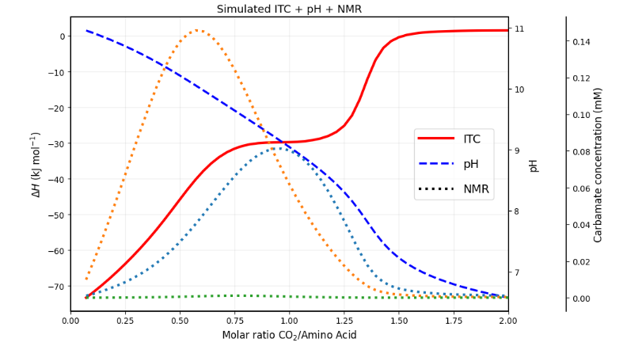

# CO₂AST – CO₂–Amine Speciation and Titration

**CO₂AST (CO₂–Amine Speciation and Titration)** is a mechanistic thermodynamic and kinetic modeling framework for simulating aqueous CO₂–amine systems during titration and calorimetric experiments. The software predicts solution speciation, pH evolution, and reaction energetics by coupling acid–base equilibria, carbonate chemistry, amine protonation, carbamate formation, and mass and charge balance within a unified numerical framework. CO₂AST simulates the injection-by-injection addition of aqueous CO₂ and supports the simulation and global fitting of experimental datasets, including pH titrations, isothermal titration calorimetry (ITC), and complementary spectroscopic measurements, enabling the estimation of equilibrium constants, enthalpies, and other thermodynamic parameters. Following parameter optimization, CO₂AST provides profile likelihood analysis for confidence interval estimation and parameter identifiability using previously fitted parameter sets. The framework also includes a two-dimensional heatmap generator that leverages the simulation engine to predict total carbon capture and carbamate formation over user-defined parameter spaces. Designed to be extensible, CO₂AST provides a platform for investigating CO₂ capture chemistries ranging from simple amino acids to multifunctional amines and more complex absorbent systems.

## Example Simulation

The figure below shows a representative CO₂AST simulation illustrating the predicted evolution of pH, carbamate speciation, and thermodynamic response during the injection-by-injection addition of aqueous CO₂.

  

## Current Release

The current release is provided as a fully functional JupyterLab implementation. It includes an interactive simulation environment with parameter sliders for exploring model behavior and evaluating the effects of thermodynamic and experimental parameters. A dedicated Python package and graphical user interface (GUI) are planned for a future release.

CO₂AST currently accepts:

* **NMR speciation data** as carbamate population measurements.
* **pH titration data** as pH versus injection number (or injection volume).
* **ITC data** as integrated heats rather than raw calorimetric power traces.

Example experimental data formats are provided in the **`examples/`** directory.

